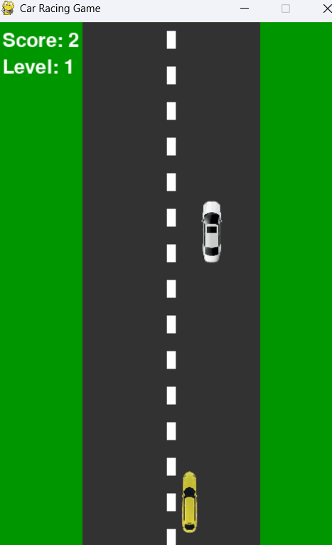
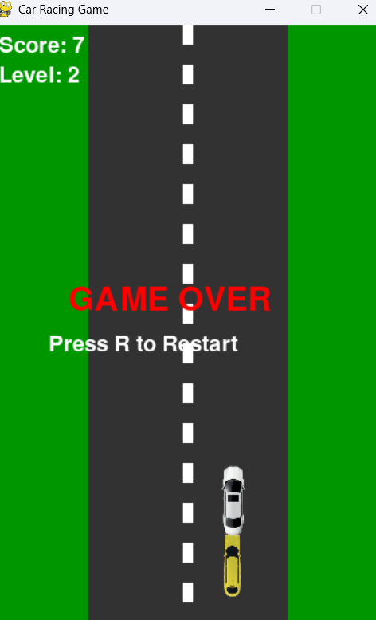

# 🚗 Pygame Car Racing Game

A simple car racing game built using **Python** and **Pygame**.

---
## 📸 Screenshots

### Gameplay


### Game Over


## 🎮 Features
- Player-controlled car
- Enemy cars
- Collision detection
- Game over screen
- Game assets (car, road, sounds)

---
## 🕹️ Controls
- ⬅️ Left Arrow – Move Left  
- ➡️ Right Arrow – Move Right
  ---

## 🛠️ Technologies Used
- Python
- Pygame

---

## ▶️ How to Run the Game

1. Clone the repository:
   ```bash
   git clone https://github.com/srikumar-pal/pygame-car-racing-game.git
Go to the project folder:

   cd pygame-car-racing-game


2. Install pygame:

   pip install pygame


3.Run the game:

   python main.py
==========================================================
📂 Project Structure
pygame-car-racing-game/
│── main.py
│── assets/
│   ├── car.png
│   ├── road.png
│   ├── crash.wav
│   └── engine.wav
│── .gitignore

👨‍💻 Author

Srikumar Pal

GitHub: https://github.com/srikumar-pal
==================================================================

